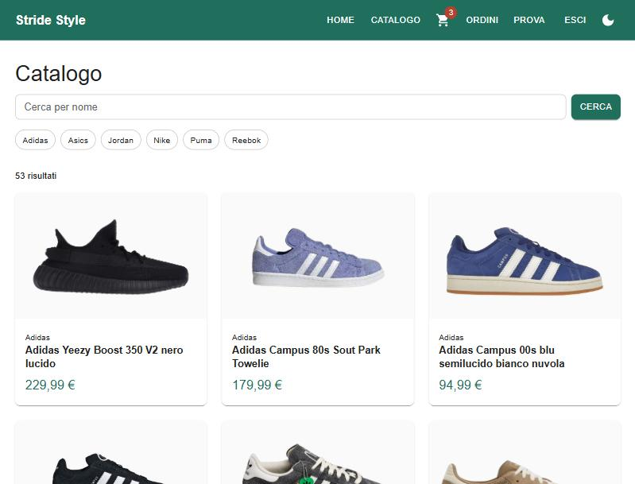
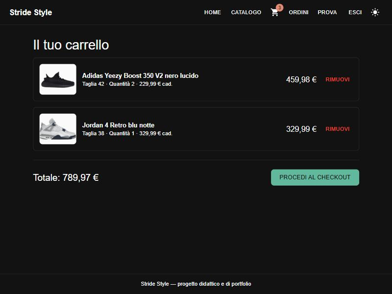
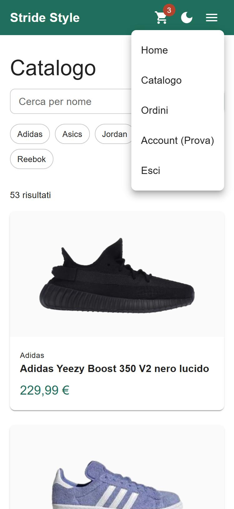

# 🛒 E-Commerce Full Stack – Spring Boot, React and JavaFX

[](https://github.com/AzureKodo502/fullstack-ecommerce-javafx-springboot/actions/workflows/ci.yml)
[](https://github.com/AzureKodo502/fullstack-ecommerce-javafx-springboot/actions/workflows/frontend.yml)


> **IT Versione italiana disponibile qui → [Leggi in Italiano](./README.md)**

## 🌟 Overview

This project is a **full-stack e-commerce application**: a **Spring Boot REST backend** with **JWT** authentication and **two clients** consuming the same API:

- a **React SPA** (web client, in `Frontend-React/`) — responsive, with light/dark theme;
- the original **JavaFX desktop client** (in `Frontend/`), kept and working.

The application simulates a real-world online shoe store and allows users to browse products, manage a shopping cart, and place an order through a client-server architecture.

The main goal of this project was to design a scalable and maintainable software system following industry best practices such as layered architecture, RESTful communication, automated testing and continuous integration.

---

## Screenshots

### Before and after: same backend, two clients

| | **JavaFX** (original) | **React** (web) |
|:---|:---:|:---:|
| **Catalog** |  |  |
| **Cart** |  |  |

### React client only

| **Product detail** | **Mobile** (menu open) |
|:---:|:---:|
|  |  |

### Login (JavaFX client)


---

## How to Run

The **Backend** must always be running; then pick a client.

### Prerequisites
* **Java JDK 21** installed.
* **Maven** (optional, wrapper is included).
* **Node.js 24 (LTS)** — only for the React client.

### Step 1: Start the Backend
Open a terminal in the `Backend` folder and run:
```bash
./mvnw spring-boot:run
```
The backend starts on `http://localhost:8080`.

### Step 2a: Start the React client (web)
Open a terminal in the `Frontend-React` folder and run:
```bash
npm install
npm run dev
```
The app is at `http://localhost:5173`.

### Step 2b: Start the JavaFX client (desktop)
Alternatively, open a terminal in the `Frontend` folder and run:
```bash
./mvnw javafx:run
```

---

##  Architecture

The application follows a layered architecture on the backend and on the clients.

### Backend – Spring Boot

- Controller Layer → REST endpoints  
- Service Layer → Business logic  
- Repository Layer → Data access via JPA/Hibernate  
- Model Layer → Entity mapping  
- Security Layer → Stateless JWT authentication (filter + Spring Security configuration)

Authentication is **stateless**: login returns a signed JWT (24-hour expiry) that the client sends in the `Authorization: Bearer` header. The catalog and images are public; cart and orders require a valid token **and** check that the resource belongs to the authenticated user (`403` otherwise).

### Frontend – React (web)

- Pages → Screens, loaded lazily (per-page code-splitting)
- Hooks → Data access (`useScarpe`, `useOrdini`…) with loading and error state
- API Layer → A single HTTP client that attaches the token and normalizes errors
- Context → Global auth and cart state (React Context + `useReducer`)

Cart and orders use the **backend as the source of truth**: the client does not recompute business rules, it updates its state with what the server answers.

### Frontend – JavaFX (desktop)

- Controller → UI handling  
- Service Layer → API communication  
- ApiClient → HTTP requests handling (attaches the JWT)
- JSON Parser → Data mapping  

---

##  Technologies Used

### Backend
- Java
- Spring Boot
- Spring Web
- Spring Data JPA
- Spring Security + JWT (jjwt)
- Hibernate
- H2 Database
- Lombok
- BCrypt password encryption

### React Frontend
- React 19 + Vite
- React Router
- Material UI (light/dark theme, responsive)
- Context API + `useReducer`

### JavaFX Frontend
- JavaFX
- FXML
- CompletableFuture (async operations)
- HTTP Client
- JSON Parsing

### Testing and quality
- JUnit 5, Mockito, Spring Test (`MockMvc`, `@DataJpaTest`)
- Vitest, React Testing Library
- GitHub Actions (separate CI for backend and frontend)
- oxlint

### Tools
- Maven
- npm
- Git
- IntelliJ IDEA
- Scene Builder

---

##  Features

###  Authentication
- User registration
- Login with server-side password hashing (BCrypt + salt)
- JWT session; when it expires the user is signed out with a clear message

---

###  Product Catalog
- Product listing
- Brand filtering
- Search by name
- Detail page with size selection
- Dynamic loading from backend

---

###  Shopping Cart
- Add products with size selection
- Automatic quantity merge
- Remote cart persistence
- Real-time cart synchronization

---

###  Checkout System
- Transactional order creation
- Automatic cart reset after checkout
- Order history

---

###  Performance & UX
- Asynchronous UI updates
- Non-blocking API communication
- Structured error handling (clear messages, even when the server is unreachable)
- Responsive web client (phone to desktop), light/dark theme, basic accessibility (keyboard navigation, page titles)

---

##  Database

The backend uses an H2 file-based database that persists data between application restarts.

The database is automatically populated through a CommandLineRunner script that prevents duplicate entries.

---

## 🧪 Testing

The project has **140 automated tests**: **70 on the backend** and **70 on the React frontend**.

### Backend (JUnit 5 + Mockito)

| Layer | Technique | What it checks |
|---|---|---|
| **Service** | Mockito (`@ExtendWith(MockitoExtension.class)`) | Isolated business logic: email uniqueness, BCrypt hashing, cart quantity merge, order total, error paths |
| **REST Controller** | `@WebMvcTest` + `MockMvc` | Routing, JSON (de)serialization, status codes (200 / 400 / 401 / 403 / 404), ownership check, no password hash in responses |
| **Repository** | `@DataJpaTest` + in-memory H2 | Derived and custom queries (`findByNomeContainingIgnoreCase`, `findByUserAndScarpaAndTaglia`, `@Modifying` DELETE), `unique` constraint |
| **Security** | Unit tests + `@SpringBootTest` | JWT generation and validation; with the real filter and tokens: 401 without a token, 403 with another user's token, 200 with the right one |

### Frontend (Vitest + React Testing Library)

| What | What it checks |
|---|---|
| **HTTP client** | `Authorization` header, JSON / text / empty responses, network errors, token expiry |
| **Providers** (`AuthProvider`, `CartProvider`) | Session restore, login/logout, cart lines merged without duplicates, late responses discarded |
| **Hooks, utilities, components** | Total computed in cents, `useAsync`, protected routes, login and registration forms, navbar (desktop and mobile), theme, 404 routing |

Tests on the most delicate logic were also verified **by mutation**: deliberately breaking the code must make exactly the dedicated test fail.

### Continuous integration

Two independent **GitHub Actions** workflows, each with a **path filter** (a PR touching only the frontend does not run Maven, and vice versa):

- `ci.yml` → backend: `./mvnw verify` (JDK 21)
- `frontend.yml` → frontend: `npm ci`, lint, test, build (Node 24)

```bash
# backend (Backend/ folder)
./mvnw test

# frontend (Frontend-React/ folder)
npm test
```

---

##  Future Improvements (Roadmap)

- Advanced Wishlist: Implementation of the Favorites/Wishlist management (Currently in MVP placeholder status).
- Payment Gateway: Integration with Stripe or PayPal for real transactions (today an order is created already confirmed).
- Detailed order history: expose order lines (today the API returns only the header and the total).
- Deployment: web client on static hosting, backend with a persistent database (a file-based H2 does not survive on free hosting).
- Dockerization: Containerizing the Backend for easier deployment.
- Multi-currency: API integration for currency conversion.

---

##  What I Learned

Through this project I developed practical experience in:

- Designing layered software architecture  
- Building RESTful APIs  
- Stateless authentication with JWT and Spring Security, and resource-level authorization
- Building a React SPA (hooks, Context, routing, code-splitting)
- Automated testing: unit, slice and integration tests (JUnit/Mockito, Vitest/Testing Library)
- Continuous integration with GitHub Actions
- Integrating backend services with desktop applications  
- Managing asynchronous UI operations  
- Database modeling with JPA/Hibernate  

---
### Documentation
- Full Javadoc coverage for Service and Controller layers.
  
 ### Code Quality
- Comprehensive **Javadoc** for all backend components to ensure maintainability and team collaboration.

### Notes
- The JavaFX Frontend component of this application was initially developed as part of a **collaborative university project**, demonstrating teamwork and shared code management. The Backend was subsequently re-architected and expanded individually to implement a robust Spring Boot microservice structure.
- The **React client**, the automated tests, the CI and the JWT authentication were added afterwards, individually, starting from the existing project.
- Please note that **source code comments, variable names, and Javadoc documentation are written in Italian**, for the original academic requirements.
  
## License
Project created for educational purposes and personal portfolio.

##  Author

Developed by **Oleksandr Bevtsyk**
